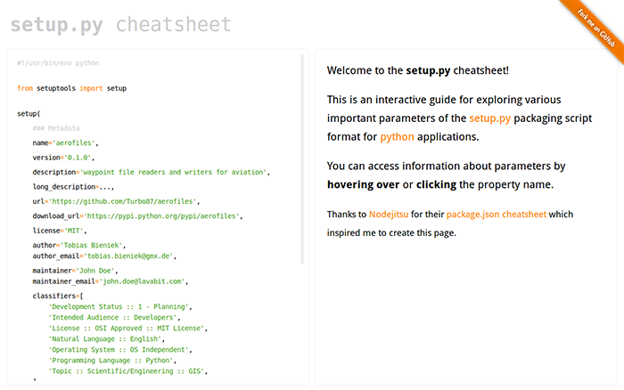

# setup.py cheatsheet

This repository holds the code for the interactive setup.py cheatsheet. It was
inspired by the [package.json cheatsheet](http://package.json.nodejitsu.com/)
from the [nodejs](http://nodejs.org/) community and provides the same service
for the `setup.py` file which is common for most python projects.

## License

This code is published under the MIT license. See the [LICENSE](LICENSE) file for the full text.
